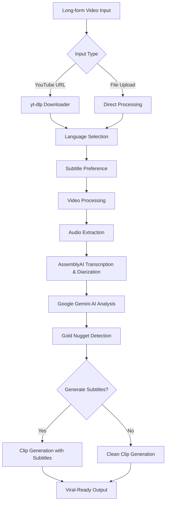

#  Clipah
### AI-Powered Video Clip Generator

*Transform long-form videos into viral-ready clips with the power of AI*

[🚀 **Try Live Demo**](https://clipah.up.railway.app/)

---

## 🌟 What is Clipah?

**Clipah** is an intelligent web application designed to automate the tedious process of finding and creating short, shareable clips from long-form videos like podcasts, interviews, and speeches. It acts as an AI assistant that analyzes dialogue to find "gold nugget" moments and generates viral-ready clips with subtitles and custom branding.

Whether you have a YouTube video URL or a local video file, Clipah uses advanced AI to analyze content, identify key moments, and create perfectly timed highlight clips ready for social media or content distribution. No more manual scrubbing through hours of footage - let AI do the heavy lifting!

### 🎯 Perfect for:
- 📱 **Content Creators** - Extract highlights from streams and long-form content
- 🎥 **Social Media Managers** - Create engaging short clips for platforms
- 🎙️ **Podcasters** - Generate video snippets from podcast episodes  
- 📺 **Marketers** - Create promotional clips from webinars and presentations
- 🗣️ **Interview Creators** - Find the best moments from lengthy conversations
- 📚 **Educators** - Extract key teaching moments from lectures

---

## ✨ Features

<table>
<tr>
<td width="50%">

### 🧠 **AI-Powered Analysis**
- **"Gold Nugget" Detection** - Finds the most engaging moments automatically
- **Multi-Language Support** - Process videos in English and Indonesian
- **Speaker Diarization** - Recognizes different speakers in the video
- **Context Understanding** - Uses Google Gemini AI for intelligent clip selection
- **Dialogue Analysis** - Identifies viral-worthy quotes and insights

### 📥 **Flexible Input Options**
- **YouTube Integration** - Direct URL processing with yt-dlp
- **File Upload Support** - Multiple video formats (MP4, AVI, MOV, MKV, WebM, etc.)
- **Drag & Drop Interface** - Intuitive file handling
- **Long-form Content** - Perfect for podcasts, interviews, and speeches
- **Language Selection** - Choose between English and Indonesian processing

</td>
<td width="50%">

### 🎨 **Professional Output**
- **Viral-Ready Clips** - Optimized for social media platforms
- **Flexible Subtitles** - Choose to generate subtitles or keep clips clean
- **Auto Subtitles** - Generated from AI transcription in selected language
- **Custom Watermarks** - Optional branding for your clips
- **Batch Processing** - Generate multiple clips simultaneously
- **ZIP Download** - Convenient package delivery

### ⚡ **Real-time Processing**
- **Live Progress Tracking** - Monitor processing status
- **Error Handling** - Comprehensive error reporting
- **Fast Processing** - Optimized for speed and efficiency
- **Automated Workflow** - No manual video editing required

</td>
</tr>
</table>

---

## 🏗️ Architecture

Clipah combines multiple powerful technologies to automate clip creation:

### 🔧 Technology Stack

**Backend (Python/Flask)**
- 🎵 **yt-dlp** - YouTube video downloading
- 🗣️ **AssemblyAI** - Audio transcription and speaker diarization
- 🤖 **Google Gemini AI** - Content analysis and "gold nugget" detection
- 🎬 **MoviePy** - Video processing and editing
- ⚙️ **FFmpeg** - Advanced video/audio encoding and format conversion
- ⚡ **Flask** - Web framework and templating

**Frontend**
- 🌐 **HTML5** - Semantic markup structure
- 🎨 **CSS3** - Custom styling and animations
- ⚡ **Vanilla JavaScript** - Interactive UI without frameworks
- 🖱️ **Native APIs** - Drag & drop, file handling, fetch API
- 📱 **Responsive Design** - Mobile-friendly interface
- 🔄 **Real-time Updates** - AJAX for status monitoring

---

## 📖 How It Works

### 🔄 AI-Powered Processing Pipeline

1. **📥 Input Processing**
   - YouTube URL validation and download via yt-dlp
   - File upload handling with drag & drop support

2. **🌍 Language Selection**
   - User selects video language (English or Indonesian)
   - System configures transcription and AI models accordingly

3. **📱 Subtitle Preference**
   - User chooses whether to generate subtitles or create clean clips
   - System configures output pipeline accordingly

4. **🎵 Audio Extraction**
   - Extract high-quality audio track from video using FFmpeg
   - Format conversion for optimal transcription

5. **📝 Language-Specific Transcription & Speaker Analysis**
   - AssemblyAI processes audio with language-specific models
   - Speaker diarization identifies different voices
   - Timestamp alignment for precise clip timing

6. **🤖 AI Content Analysis & "Gold Nugget" Detection**
   - Google Gemini AI analyzes transcript with language context
   - Identifies viral-worthy quotes, insights, and key topics
   - Detects emotional peaks and audience engagement points
   - Generates clip suggestions with AI reasoning in appropriate language

7. **✂️ Intelligent Clip Generation**
   - MoviePy and FFmpeg process video based on AI suggestions
   - Applies professional fade effects and transitions
   - Conditional subtitle generation based on user preference
   - Optional watermark application for branding

8. **📦 Flexible Output Delivery**
   - Individual clip files with or without subtitles
   - ZIP package creation for bulk download
   - Automatic cleanup of temporary files

---

## 🎮 Usage Guide

### Via Web Interface

1. **Choose Input Method**
   - 📹 **YouTube Tab**: Paste podcast, interview, or speech URL
   - 📁 **Upload Tab**: Drag & drop or select long-form video file

2. **Select Video Language**
   - 🇺🇸 **English**: For English-language content
   - 🇮🇩 **Indonesian**: For Indonesian-language content

3. **Configure Output Options**
   - ✅ **Enable/Disable Subtitles**: Choose whether to generate subtitles
   - ✅ **Enable/Disable watermark** for brand consistency
   - 📝 **Enter custom watermark text**

4. **Generate AI Clips**
   - Click "Generate Clips" button
   - Monitor real-time progress bar

5. **Download Content**
   - Preview AI-generated clips information
   - Download complete ZIP package

---

## ⚠️ Limitations & Known Issues

While Clipah is a powerful tool for automated clip generation, there are some current limitations to be aware of:

<table>
<tr>
<td width="50%">

#### **Railway Hosting Constraints**
- **Limited CPU Power** - Processing may be slower than local deployment
- **Memory Restrictions** - Large videos (>2GB) may cause memory issues
- **Processing Timeouts** - Very long videos (3+ hours) may timeout
- **Concurrent Users** - Performance degrades with multiple simultaneous users
- **Disk Space** - Limited temporary storage for large file processing

</td>
<td width="50%">

#### **Video Quality Impact**
- **Compression Artifacts** - Output quality depends on server processing power
- **Resolution Limits** - May downscale high-resolution videos to manage resources
- **Frame Rate** - Possible reduction in frame rates for complex processing
- **Audio Quality** - Compression may affect audio clarity in output clips
- **Encoding Speed** - Slower processing due to limited computational resources

</td>
</tr>
</table>

---

### 📫 Get in Touch

**Found Clipah useful for your content?** ⭐ Star this repository to show your support!

**Have questions or ideas?** 💬 Reach out to [@iZekCode](https://github.com/iZekCode)

---

**Made with ❤️ by [iZekCode](https://github.com/iZekCode)**

*Clipah - Making viral content creation effortless, one "gold nugget" at a time.*

