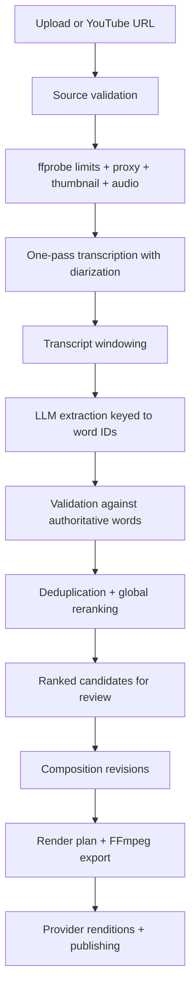

<div align="center">

#  Clipah

**Turn long-form video into short clips you can defend.**

</div>

Clipah takes a podcast, interview, lecture, or stream and proposes the moments worth
cutting, with the evidence behind each one. A reviewer sees the ranked candidates, the score
that produced the order, the context each moment depends on, and any warning that cutting
there would mislead — before a single frame is rendered. What survives review can be edited,
styled, rendered, and published.

---

## Contents

- [How it works](#how-it-works)
- [Accounts and Workspaces](#accounts-and-workspaces)
- [The dashboard](#the-dashboard)
- [Architecture](#architecture)
- [Local setup](#local-setup)
- [Repository layout](#repository-layout)
- [Transcription and model routing](#transcription-and-model-routing)
- [Source imports and the cookie question](#source-imports-and-the-cookie-question)
- [The editor](#the-editor)
- [B-roll and generated media](#b-roll-and-generated-media)
- [Brand kits, templates, and campaigns](#brand-kits-templates-and-campaigns)
- [Social publishing](#social-publishing)
- [Data retention and deletion](#data-retention-and-deletion)
- [Testing](#testing)
- [Deployment](#deployment)
- [Operations and incidents](#operations-and-incidents)

---

## How it works

1. **Import.** Upload a file in resumable parts, or import one public YouTube video. The
   source is validated before any media is fetched.
2. **Ingest.** FFprobe checks duration, streams, resolution, and codecs against fixed
   limits. A 720p proxy, a thumbnail, and 16 kHz mono transcription audio are produced, each
   with a deterministic key and a verified SHA-256.
3. **Transcribe.** One pass produces word-level timestamps, confidence, punctuation, real
   speaker diarization, and speaker segments. Everything downstream reads from that one
   transcript.
4. **Analyse.** The transcript is split into overlapping windows at natural boundaries. A
   language model proposes candidates **keyed to word IDs**, never to timestamps. Every
   proposal is validated against the authoritative words, then deduplicated by temporal
   overlap and excerpt similarity, then reranked globally.
5. **Review.** Candidates arrive ranked, with a hook, a payoff, seven score dimensions, the
   context each clip depends on, and any context warning. This happens before any render
   exists.
6. **Edit.** Trim, crop, caption, style, and add B-roll. Every action writes a new immutable
   composition revision; the source asset is never touched.
7. **Render.** The composition compiles to a render plan and is exported through FFmpeg
   invoked as an argument array.
8. **Publish.** Optionally schedule to YouTube Shorts, Instagram Reels, or TikTok through
   each platform's official API.

**A model cannot invent a timestamp.** It proposes word IDs; Clipah resolves the bounds and
refuses a proposal whose excerpt does not reproduce the transcript. That single rule is why
the pipeline is built the way it is.

## Accounts and Workspaces

- Every new user gets **one personal Workspace**. Team Workspaces can be created alongside
  it.
- Sign-in is Google OIDC with PKCE. Sessions are opaque tokens stored SHA-256-only, with
  idle and absolute expiry and a ten-minute recent-authentication window.
- Changing the email on an identity does not create a new user, and equal emails from
  different issuers never auto-link accounts.
- Roles nest: `owner` ⊃ `admin` ⊃ `editor` ⊃ `reviewer` ⊃ `viewer`. Publishing sits outside
  that ladder and is resolved by each Workspace's own publishing policy.
- The last owner cannot leave or delete their account without transferring ownership or
  deleting the Workspace outright.

Isolation is structural, not conventional. Every tenant row carries `workspace_id`, child
rows reference their parent through a composite `(workspace_id, id)` foreign key so nothing
can be re-parented across Workspaces, and row-level security applies on top as defence in
depth. **A UUID you have no standing on returns exactly the same 404 as one that does not
exist** — same code, same message.

## The dashboard

| Route | What it is |
| --- | --- |
| `/` | Landing page |
| `/signin` | Google sign-in |
| `/demo` | Bundled example candidates; calls no endpoint |
| `/dashboard` | Workspace overview |
| `/dashboard/projects` | Project library |
| `/dashboard/projects/[id]` | One Project: upload, import, progress |
| `/dashboard/clips` | Ranked candidates across the Workspace |
| `/dashboard/clips/[id]` | One candidate with its full evidence |
| `/editor/[id]` | The clip editor |
| `/dashboard/assets` | Uploaded and retrieved media |
| `/dashboard/templates` | Reusable templates |
| `/dashboard/brand-kits` | Brand kits |
| `/dashboard/team` | Members and roles |
| `/dashboard/publishing` | Scheduling, composer, history |
| `/dashboard/settings` | Workspace settings |
| `/dashboard/settings/connections` | Social Account connections |

One Workspace-wide Server-Sent Events stream feeds the job centre. It survives navigation,
resumes from `Last-Event-ID` after a dropped connection, and empties when the active
Workspace changes.

## Architecture


```mermaid
graph TD
    A[Upload or YouTube URL] --> B[Source validation]
    B --> C[ffprobe limits + proxy + thumbnail + audio]
    C --> D[One-pass transcription with diarization]
    D --> E[Transcript windowing]
    E --> F[LLM extraction keyed to word IDs]
    F --> G[Validation against authoritative words]
    G --> H[Deduplication + global reranking]
    H --> I[Ranked candidates for review]
    I --> J[Composition revisions]
    J --> K[Render plan + FFmpeg export]
    K --> L[Provider renditions + publishing]
```

**Backend.** FastAPI for the API, Celery for durable jobs across ten queues, Celery beat for
scheduling, Postgres for durable state, Redis for rate limits and job-event wakeups, and
S3-compatible object storage for media. Jobs hold their state machine as data, append events
under the same lock that assigns their sequence, and retry with backoff without duplicating
records or artifacts. Killing an API process does not affect a running job; killing a worker
causes a redelivery, not a duplicate.

**Frontend.** Next.js 15, React 19, TypeScript in strict mode, TanStack Query. Request and
response types are generated from `contracts/openapi.json` and never hand-written. Every
call goes through one `apiFetch`, which keeps paths same-origin, echoes the double-submit
CSRF token, and raises failures as an error carrying the backend's code and request ID.
Nothing is rendered as markup: `dangerouslySetInnerHTML` is a lint error, so provider text,
transcripts, filenames, and watermark text render as text and cannot execute anything.

## Local setup

```bash
docker compose -f infra/compose.yaml up -d     # Postgres, Redis, MinIO on loopback
pnpm install
cd backend && uv sync --all-extras && uv run alembic upgrade head
```

Then run the API, a worker, and the frontend. **`NEW_CLIPAH_ENABLED=true` is required for
the UI to appear**; it is the cutover flag and it fails closed.

`ENVIRONMENT_SETUP.md` has the full walkthrough, the Google OIDC setup, and the complete
inventory of every environment variable. `docs/operations/cutover.md` explains the flag.

### Migrations

```bash
cd backend && uv run alembic upgrade head
```

Migrations run as `clipah_migrator`. The application itself connects as the least-privilege
logins `clipah_api_runtime` and `clipah_worker_runtime`, which hold no migration rights, and
the API and worker roles are each refused the other's connection string at startup.

### Workers

Ten queues: `source_import`, `ingest`, `ai`, `broll_retrieve`, `broll_generate`, `render`,
`social_rendition`, `social_publish`, `social_reconcile`, and `maintenance`. Each Railway
service in `infra/railway/` consumes a named subset. Workers acknowledge late with a
prefetch of one, so a lost worker's job is redelivered rather than dropped, and every task
carries only UUID strings across the broker — never an ORM object, a session, or a token.

### Storage

Media lives in S3-compatible object storage under server-generated tenant keys. Uploads are
multipart with a 2 GiB ceiling; each part is signed inside the attempt that uses it, so a
resumed upload asks for a fresh five-minute capability rather than replaying an expired one.
Download URLs are signed for five minutes and private keys are never exposed. Each job gets
its own `0700` workspace directory, not a shared working file.

## Transcription and model routing

Transcription is AssemblyAI, and **the model is chosen by language, not by configuration**.
English, Spanish, German, French, Portuguese, and Italian use `universal-3-pro`. Indonesian
and every other language outside that set use `universal-2`. An unspecified language tries
U3 Pro and falls back to U2. Code-switched audio is covered by the evaluation fixtures.

Highlight extraction and reranking run on Groq with strict JSON Schema requests in which
every property is required and additional properties are forbidden, at temperature zero.
**No configured production model ID may be retired**: startup refuses one, including the
Llama 4 Scout IDs Groq shut down. A provider failure falls back to an offline deterministic
provider only when it is retryable, and that fallback is recorded on the candidate.

`scripts/run-highlight-eval.sh` and `scripts/run-transcription-eval.sh` score a versioned,
tamper-evident fixture set. A case whose bytes do not match its recorded digest is refused
rather than scored.

## Source imports and the cookie question

Public YouTube import accepts exactly one HTTPS single-video URL. Deceptive authorities and
playlists are rejected, every DNS result must be globally routable, and rebinding and unsafe
redirects are detected. yt-dlp runs shell-free in an isolated process group with a sanitized
environment, a timeout, bounded output, a 2 GiB ceiling, and path containment.

**Public import needs no credential of any kind**, and no certificate check is ever
disabled.

Authenticated import exists, is off by default behind
`CLIPAH_AUTHENTICATED_SOURCE_IMPORT_ENABLED`, and is built on the assumption that a cookie
jar is a live credential rather than a configuration file. A credential reaches yt-dlp the
only way it can, as a file, and everything about that file is narrowed: it is leased for one
import, written `0600` inside that Job's own `0700` workspace, passed as an argument-array
value rather than through a shell or an environment variable, redacted from every
diagnostic, and removed on success, failure, cancellation, and worker shutdown alike.
Nothing plaintext reaches a durable store or any telemetry, and a revoked or expired
connection cannot be leased at all.

**`--cookies-from-browser` is deliberately not offered.** On a hosted worker the browser
profile belongs to the machine, not to the member, so the flag would read somebody else's
session.

Supplying account cookies to a downloader still carries a Terms of Service risk that no
amount of engineering removes. That is the member's decision to make, which is why the
capability is flagged off rather than assumed.

## The editor

Editing is non-destructive. Every action produces a new immutable composition revision and
the source asset's checksum never changes. The editor covers the timeline, assets, sound,
text, scenes, styling, karaoke word timings, keyframes, templates, motion, and smart crop,
with autosave.

**The browser engine is Mediabunny**, recorded in `docs/adr/0001-browser-editor-engine.md`
as Accepted. The bake-off ran both candidates through one port with a byte-for-byte
composition comparison, on real GPU hardware in Chromium and WebKit, against 30- and
60-minute proxies. Safari decided it: the alternative's median seek was 409 ms against a
150 ms gate and a one-hour timeline never completed. The ADR carries the full matrix,
including the one gate still outstanding and the licence scan behind
`scripts/check-editor-licenses.sh`.

## B-roll and generated media

Semantic beats are modelled from the transcript and turned into a deterministic B-roll plan.
**Proposed B-roll never changes a composition.** A suggestion is a suggestion until someone
accepts it; accepted B-roll stays editable, preserves dialogue audio by default, and keeps
complete provenance — which provider, which licence, which retrieval.

Stock retrieval always precedes generation, and retrieval stops early when it already has
enough. Generation is a last resort and is heavily gated: a generated-video job cannot start
without an estimate, a quota reservation, moderation, and an explicit confirmation from a
member. Default Workspace budgets are 30 analyses, 200 stock requests, 50 generated images,
10 generated videos, 300 generated seconds, and 100 publications per month. Generated video
stays off behind its own flag. `docs/operations/generative-media.md` covers cost, safety,
and how to stop generation quickly.

## Brand kits, templates, and campaigns

Brand kits hold the colours, fonts, and marks a Workspace reuses. Templates capture a styling
and layout decision so it can be applied again. Campaign workflows turn one moment into a set
of platform-specific variants, each of which still maps to authoritative word boundaries. The
content library indexes everything a Workspace has produced and makes it searchable.

## Social publishing

Publishing is off until it is switched on, per provider, with complete OAuth configuration
present at startup.

| Provider | API | Scopes | Status gate |
| --- | --- | --- | --- |
| YouTube Shorts | Data API v3 | `youtube.upload`, `youtube.readonly` | Audit flag |
| Instagram Reels | Graph v22.0 | Content publishing and account read | Audit flag |
| TikTok | v2 | `video.upload`, and `video.publish` only after audit | **Draft fallback until Direct Post audit approval** |

OAuth grants are encrypted at rest through a local wrapping key or AWS KMS, and are kept
separate from Login Sessions and from source-import credentials. No plaintext token,
authorization code, resumable checkpoint, or client secret appears in durable data, logs,
events, analytics, API responses, or job arguments.

Publications run a state machine with immutable per-provider renditions, preflight checks,
idempotent dispatch, and reconciliation against what the provider actually did. Scheduling
supports multiple destinations from one composition. A member removed from a Workspace cannot
dispatch a Publication they prepared earlier.

**No flag bypasses a provider's consent, privacy, disclosure, or review requirements.**
`docs/operations/social-publishing.md` holds those obligations, including the data-deletion
callbacks each platform requires and where they are served.

## Data retention and deletion

| Thing | Window |
| --- | --- |
| Soft-deleted Project | 30 days, recoverable |
| Soft-deleted Workspace | 30 days, recoverable |
| Deleted account | 30 days |
| Abandoned upload | 24 hours |
| Failed-job workspace | 7 days, for diagnostics |
| Unselected stock preview | 24 hours |
| Rejected generated draft | 24 hours |

A retention sweep runs on the scheduler. Account deletion removes durable records and the
objects behind them, and honours the provider deletion callbacks.
`docs/operations/data-retention.md` is the full procedure.

## Testing

Backend, from `backend/`:

```bash
uv run ruff check .
uv run ruff format --check .
uv run mypy src
uv run pytest -q --cov=clipah --cov-fail-under=90
```

Frontend, from the repository root:

```bash
pnpm lint
pnpm typecheck
pnpm test
pnpm build
```

Backend tests are split into `unit` (no infrastructure), `integration` (real Postgres), and
`contract` (behaviour promised to other parts of the system). Markers are strict, so an
undeclared marker is an error rather than a silent skip, and every test carries a name that
states the behaviour and a docstring that states why it matters.

Beyond the four gates, CI runs the generated-contract check, the editor licence scan, the
social provider contracts, the Playwright browser suite, a golden-frame comparison against
signed-off renders, and a container smoke that replays a fixed identity twice.
`plan.md` Section 12 lists every command and every behavioural proof.

## Deployment

Each service is a container built from `infra/docker/backend.Dockerfile` with a pinned media
toolchain, running as a non-root user. `infra/railway/` holds one configuration per service —
the API, the scheduler, and six worker roles — each declaring the variables it requires;
startup fails rather than running half-configured. `scripts/verify-runtime.sh` builds every
image and proves the runtime locally.

Rolling the product out, and rolling it back, is `docs/operations/cutover.md`.

## Operations and incidents

| Topic | Document |
| --- | --- |
| Cutover, rollout stages, rollback | `docs/operations/cutover.md` |
| Dashboards, alerts, provider usage | `docs/operations/observability.md` |
| Recovery drills and restores | `docs/operations/recovery.md` |
| Publishing incidents and obligations | `docs/operations/social-publishing.md` |
| Generation cost and safety | `docs/operations/generative-media.md` |
| Retention and deletion | `docs/operations/data-retention.md` |
| Editor engine decision | `docs/adr/0001-browser-editor-engine.md` |

---

<div align="center">

**Made by [iZekCode](https://github.com/iZekCode)**

</div>
